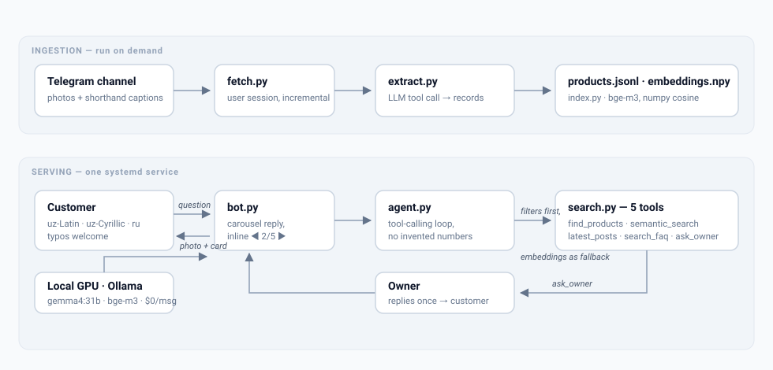

# Shop Assistant — an AI sales assistant for Telegram shops

A Telegram bot that answers customers' *"do you have this in size 42?"* questions about a shop
whose **catalog is its Telegram channel** — no database, no website, no product feed. It reads the
channel's posts, turns them into product records, searches them, replies with a photo carousel in
the customer's own language, and asks the owner when it does not know.

The language model is a hosted **Gemini free-tier** model: no per-message API cost within the free
quota and no GPU to keep warm. **Privacy note:** customer questions and channel captions are sent to
Google, and on the free tier Google may use prompts to improve its products — a trade-off chosen on
2026-09-23 for faster replies (SRS C-2). Embeddings still run on a local Ollama host until #23.5.
Built from scratch — no LangChain, no vector database, no agent framework.



## The problem

A clothing shop sells through a Telegram channel: ~130 posts, each a photo plus a caption in
Uzbek shop shorthand (`🔥Yangi model Dvoyka🔥 / Razmer:M.L.XL / Narx:980.000ming`). Customers do
not scroll — they DM the owner. The same questions, all day: is this in stock, what size, how
much, is it still available. Half the posts have no price at all, so the owner types the answer by
hand every single time.

## What the bot does

| Customer writes | What happens |
|---|---|
| `krossovka 42 bormi?` | filter search over sizes + keywords → numbered results, each with photo, price, sizes, date, link |
| `600 ming gacha sviter` | price ceiling + product type in one query |
| `что-нибудь для холодной погоды` | no keyword matches → semantic search over multilingual embeddings |
| `narxi 2` / `2-chisi bormi?` | resolves "item 2" from the previous reply |
| price missing, or a delivery/payment question | `ask_owner` → the owner gets one message, replies to it, the answer lands in the customer's chat |
| a product the shop never sold | says so and escalates — it does **not** invent a price |

Replies are a **single carousel message**: photo, a compact card (name · price · sizes · date),
and inline buttons `◀ 2/5 ▶`, *Ask the price*, *View in channel*. Navigation edits the same
message, so one answer stays one message instead of five screens of forwarded posts.

Products older than a configurable window are marked "may be sold out — confirm with the owner",
because a Telegram channel has no stock field.

## Results

Measured on 2026-09-22 with the previous local model (`gemma4:31b`; not yet re-run on Gemini) by a 20-question eval suite (real customer phrasings in Uzbek Latin, Uzbek Cyrillic and
Russian, including questions the bot is supposed to escalate rather than answer):

| Metric | Result |
|---|---|
| Correct answers | **19 / 20** |
| Invented prices or sizes | **0** |
| Questions only semantic search could answer | 4 of 20 |
| Median reply latency | **5.7 s** on one RTX 5090 (typical p95 ~9 s; a cold model load pushes the first call to ~25 s) |
| Model cost | **$0** — local `gemma4:31b` + `bge-m3` at the time; now Gemini free tier (no cost within the free quota) |
| Tests | 168 (pytest), CI on every PR |

Deployed as a user-level systemd service; the owner's shop kept running through every change.

## How it works

1. **`fetch.py`** — Telethon *user* session reads the channel history (bots cannot), incremental
   by `min_id`, skips reposts and captionless posts.
2. **`extract.py`** — one LLM call per batch of posts with a forced tool call returns structured
   records: name, category, price, subscriber price, sizes, colors, keywords, season. Deterministic
   guards do what a prompt cannot: prices in shop notation (`980.000ming` → `980000`), product
   names that are a *type + brand* rather than the caption's slogan, and announcements
   ("New collection", a bare username) demoted so they never surface as products.
3. **`index.py`** — `bge-m3` embeddings of normalised text → a numpy matrix. Cosine similarity is
   enough for a few thousand posts; a vector DB would add nothing.
4. **`textnorm.py`** — Uzbek Latin ↔ Cyrillic transliteration plus typo-tolerant normalisation, so
   `krossovka`, `кроссовка` and `krosovka` hit the same records.
5. **`search.py`** — filters first (exact, explainable, fast), embeddings only as a fallback; every
   result carries its staleness flag.
6. **`agent.py`** — a hand-written tool-calling loop (Gemini function calling via `google-genai`, automatic calling off) with five
   tools: `find_products`, `semantic_search`, `latest_posts`, `search_faq`, `ask_owner`. The system
   prompt forbids numbers that are not in a tool result — the reason the invented-price count is 0.
7. **`bot.py`** — the customer/owner Telegram surface: carousel replies, inline navigation,
   escalation routing (`#esc <id>` header), per-turn JSONL logging.
8. **`eval/`** — the question suite and scorer that produced the table above.

Everything is plain Python: 1 600 lines across 12 modules, JSONL storage, no framework.

## Run it on your own channel

```bash
uv venv && uv pip install -r requirements.txt
cp .env.example .env          # TG_CHANNEL, Telegram api id/hash, bot token, owner id, GEMINI_API_KEY, OLLAMA_URL
uv run python -m shop_assistant.fetch     # channel → data/posts.jsonl
uv run python -m shop_assistant.extract   # posts → data/products.jsonl
uv run python -m shop_assistant.index     # products → data/embeddings.npy
uv run python -m shop_assistant.main      # start the bot
```

Needs a Gemini API key from Google AI Studio (`GEMINI_API_KEY`, free tier) and, until #23.5, an Ollama host with `bge-m3` (`OLLAMA_URL`). `./deploy.sh` rsyncs the repo
to `DEPLOY_HOST` and installs the systemd unit.

## Docs

- Requirements: `docs/shop_assistant_SRS.md` (numbered, testable, with acceptance criteria)
- Design and decisions: `docs/shop_assistant_SDD.md`
- Contributor workflow: `docs/WORKFLOW.md`

## Dev

```
uv run pytest -q
```

Every ticket was built the same way: requirements → design decision → tests written first on a
ticket branch → implementation → PR with CI → live check against the real channel.
